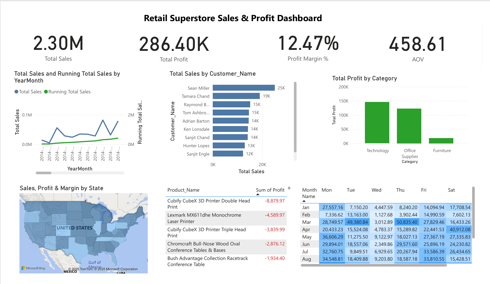

# Retail_Dashboard_Superstore
Retail Superstore Sales &amp; Profit Dashboard | SQL queries + Power BI (KPIs, trends, top customers, categories, regions)
# Retail Superstore Sales & Profit Dashboard (Power BI)

Power BI dashboard answering 12 core business questions using SQL + DAX. 
Covers sales trends, top customers, category profitability, discount impact, 
loss-making products, and regional performance.

## What's inside
- `powerbi/superstore_dashboard.pbix` – main report
- `sql/superstore_analysis.sql` – 12 business queries (MSSQL)
- `powerbi/dax_measures.txt` – KPIs & running totals
- `powerbi/theme.json` – clean theme
- `data/sample_superstore_1k.csv` – tiny sample for demo (no PII)

## Business Questions
1) Which regions drive sales/profit?  
2) Top 10 customers by revenue  
3) Monthly sales trend + running total  
4) Profit by category/sub-category
5) Do discounts hurt profitability? (analyze profit by discount band)
6) Which products generate the highest revenue and quantity sold?
7) Which states or categories are losing money (negative profit)?
8) What share of customers are repeat vs one-time buyers?
9) Does shipping mode affect profitability (which ship mode performs best)?
10) What are the busiest weekdays and months (sales heatmap)?
11) Which customers contribute the most lifetime value (revenue + profit)?
12) Which specific products consistently cause losses (negative profit items)?

## Key Insights 
📈 Overall Performance
Total Sales ≈ $2.3M with a Profit Margin of ~12.5%.
Average Order Value (AOV) indicates customers spend about $230 per order.

🛋️ Category Performance
Technology is the most profitable category, delivering the highest margins.
Furniture consistently underperforms, with lower profitability despite strong sales.

Office Supplies is stable but mid-tier in profitability.
👥 Customer Contribution
Top 10 customers account for ~15% of total sales, showing revenue concentration.
Suggests potential for a VIP/loyalty program targeting high-value customers.

🏷️ Discount Analysis
Discounts >20% are strongly correlated with negative profits.
Lower discount bands (0–10%) remain profitable → company should review promotion strategy.

🛑 Loss-Making Products
Several SKUs operate at a loss (negative profit despite sales).
These should be considered for price review, bundling, or discontinuation.

🌍 Regional & State Insights
West & East regions are the strongest contributors to profit, especially California and New York.
Central region shows weaker performance with several loss-making states.

📅 Time Patterns
Monthly trend shows steady growth, with spikes during year-end (holiday season).
Weekday trend: Tue–Thu are peak sales days, while weekends (Sat–Sun) show weaker sales activity.
Running total confirms year-over-year growth.

🔄 Customer Frequency
Most customers fall into the 2–3 orders band, with fewer repeat buyers above 6+ orders.
Indicates room to improve customer retention.

## Reproduce
1. Open `powerbi/superstore_dashboard.pbix` in Power BI Desktop.
2. (Optional) Replace data source with your SQL table `dbo.Superstore`.
3. Ensure Date table is marked; relationship: `Date[Date] -> Superstore[Order_Date]`.

## Notes
- Dataset is the public Superstore sample.
- Built with: SQL Server, Power BI, DAX.

## Contact
Ramakrishna Reddy · [LinkedIn](www.linkedin.com/in/ramakrishnareddy-parvatareddy-b44a15325) · Email: ramakrishna.parvatareddy@gmail.com
